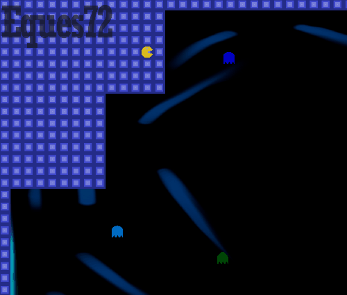

# Xonix, Pac-xon version [WIP]
Xonix is a game concept invented first by Ilan Raab and Dani Katz in 1984.
This is a variation of this concept created using C++20 with SMFL library. 

I've made it to learn new cpp features, usage of external library and multithreading.

## Installation
Clone this repository, install SFML 2.5.1 or later from offcial website [Download SFML](https://www.sfml-dev.org/download.php).
Configure project in IDE thats supports C++20 features, link SFML to the project and compile it.
Game should work after running project in debug or release mode.
Keep all files in the same folder. Currently, game supports only FullHD resolution.

## Example

## Controls
Control your character using WASD or arrow keys

## Project created for learning purposes